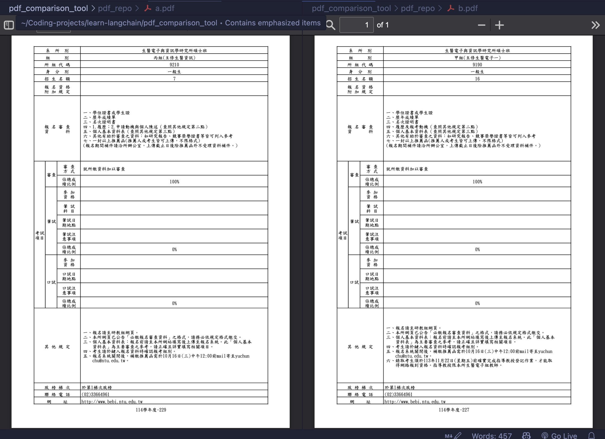

# 本文為敘述簡單的 langchain agent 實作

## 成品功能

-   可以透過自訂的 tool 去讀取 pdf 檔案的 agent
-   具有記憶性，可持續對話
-   支援 streaming

## 前置作業

### 1. 安裝套件

透過 pip 安裝所需的全部插件

```bash
pip install langchain_ollama langchain_core 'markitdown[all]' pydantic langgraph
```

### 2. 導入 LLM

本次實作我用的是 Ollama, 可以使用 Docker 跑, 可以連線後, 就可以在本地打他的 api, 請他 pull 一些模型下來, 這次我用的是 llama3.1:8b, 其他模型資訊也可以在[ollama registry](https://ollama.com/search)查詢

```bash!
curl -X POST http://localhost:11434/api/pull -d '{"name": "llama3.1:8b"}'
```

---

## 程式實作

### 本次的實作都放在`pdf_comparison_tool.ipynb`內

#### 1. 建立 llm interface

裝完 python 插件和把 ollama api 導過來以後, 就可開始建立 llm 物件

```python
from langchain_ollama import ChatOllama
llm = ChatOllama(model="llama3.1:8b")
```

#### 2. 建立工具

本次的 tool 建置過程是參照 langchain 官方的教學:
https://python.langchain.com/docs/how_to/tool_calling/

以這個加法工具為基準去更改的

```python
def add(a: int, b: int) -> int:
    """Add two integers.

    Args:
        a: First integer
        b: Second integer
    """
    return a + b
```

我的實作:

```python!
from langchain_core.tools import tool
from markitdown import MarkItDown
from pydantic import BaseModel, Field
import os

md = MarkItDown(client=llm)

@tool
def get_markdown_pdf(file_name: str) -> str:
    """
    Given a file name, return the markdown content of the PDF if the file exists.
    """
    basedir = "pdf_repo"
    files = os.listdir(basedir)
    if file_name not in files:
        return f"File {file_name} not found in {basedir}, please check the file name."
    file_path = os.path.join(basedir, file_name)
    result = md.convert(file_path)
    if result is None:
        return f"Failed to convert {file_name} to markdown."
    return result.text_content
```

1.  先建立一個 MarkItDown 物件，並且把剛剛創的 llm 放進去，讓 llm 可以偶爾幫忙他轉譯文件。（MarkItDown 是微軟開發的套件，可以把一堆文件格式轉成 markdown，這樣就很適合 LLM 理解跟後續處理。）

2.                定義一個函式，並且用 `@tool` 的 decorator 裝飾它，

    這樣 LangChain 或 LangGraph 的 agent 就可以把這個函式當成一個可以 call 的工具 (tool)。
    這個函式叫做 `get_markdown_pdf`，並且只接收一個函數 `file_name`，型別是 str(字串)，並且也會回傳字串

3.  收到一個 file_name（檔案名稱）之後：

    1. 會先去 "pdf_repo" 這個資料夾裡面列出所有檔案，檢查你給的 file_name 在不在裡面
    2. 如果不在 ➔ 回傳「找不到這個檔案」的錯誤訊息
    3. 如果檔案存在 ➔ 就用 MarkItDown 物件把這個 PDF 檔轉成 markdown
    4. 轉換結果會取出 .text_content 回傳出來
    5. 如果轉檔失敗 ➔ 回傳「轉換失敗」的錯誤訊息

4.  整個 function 的重點是：

    1. 先做防呆（檔案存在性檢查），再做轉換
    2. 最後確保無論成功或失敗，都有一個明確的回傳結果（給 agent 或 user 看）

    而且因為有 @tool 裝飾，
    這個函式可以直接被 agent 在 reasoning 的時候「工具呼叫」，
    自動接收 file_name 參數，回傳 markdown 內容，拿來後續分析或回答問題

### 3. 建立 Agent

本部分參考 langchain 官方教學
https://python.langchain.com/docs/tutorials/agents/
我的實作:

```python!
from langgraph.prebuilt import create_react_agent
from langchain_core.messages import HumanMessage
from langgraph.checkpoint.memory import MemorySaver

memory = MemorySaver()

agent_executor = create_react_agent(llm, [get_markdown_pdf], checkpointer=memory)
```

### 4-1 使用 Agent-建立 prompt template

```python!
from langchain_core.prompts import ChatPromptTemplate

prompt_template = ChatPromptTemplate.from_messages([
    ("system", "You are a professional pdf analyzer."),
    ("human", "Please compare the following files: {file_name1}, {file_name2}.")
])

# Example usage
prompted_messages = prompt_template.invoke({"file_name1": "a.pdf", "file_name2": "b.pdf"})
prompted_messages.to_messages()
```

這個 prompt 多了個 system message,讓 llm 可以更清楚自己在做什麼。

### 4-2 使用 Agent

```python!
config = {"configurable": {"thread_id": "abc124"}}

# 先用 prompt_template 生成一組訊息
prompted_messages = prompt_template.invoke({"file_name1": input("請輸入你想比較的文件1: "), "file_name2": input("請輸入你想比較的文件2: ")})

# stream
for chunk in agent_executor.stream(
    {"messages": prompted_messages.to_messages()},
    config,
):
    print(chunk)
    print("----")

```

順帶一提，以下是資料夾結構，現在只有`a.pdf`和`b.pdf`，所以我就各自輸入他們了:

```bash
╰─➤  tree pdf_repo
pdf_repo
├── a.pdf
└── b.pdf

1 directory, 2 files
```

這是兩個 pdf 的內容，是我當初在推甄的時候存的，他們是同一個所不同組的文件，滿適合拿來分析的。


這是輸出，可以看到他有正確的用 tools，也有合乎邏輯的回答。

```
{'agent': {'messages': [AIMessage(content='', additional_kwargs={}, response_metadata={'model': 'llama3.1:8b', 'created_at': '2025-04-26T12:27:40.235670386Z', 'done': True, 'done_reason': 'stop', 'total_duration': 3210384097, 'load_duration': 51231040, 'prompt_eval_count': 187, 'prompt_eval_duration': 1289929223, 'eval_count': 42, 'eval_duration': 1866685007, 'model_name': 'llama3.1:8b'}, id='run-22510df5-842a-4b22-8c28-c325b66a076c-0', tool_calls=[{'name': 'get_markdown_pdf', 'args': {'file_name': 'a.pdf'}, 'id': '874cad62-81f6-4e39-a987-5177298d0039', 'type': 'tool_call'}, {'name': 'get_markdown_pdf', 'args': {'file_name': 'b.pdf'}, 'id': '6c36a08e-ffa0-410c-857b-6f87e3768f1f', 'type': 'tool_call'}], usage_metadata={'input_tokens': 187, 'output_tokens': 42, 'total_tokens': 229})]}}
----
{'tools': {'messages': [ToolMessage(content='系\u3000所\u3000別\n\n組\u3000\u3000\u3000別\n\n所 組 代 碼\n\n身\u3000分\u3000別\n\n招 生 名 額\n\n報 名 資 格\n附 加 規 定\n\n報 名 審 查\n資       料\n\n審查\n\n筆試\n\n考試\n項目\n\n口試\n\n審 查\n方 式\n\n佔總成\n績比例\n\n參 加\n資 格\n\n筆 試\n科 目\n\n筆試日\n期地點\n\n筆試注\n意事項\n\n佔總成\n績比例\n\n參 加\n資 格\n\n口試日\n期地點\n\n口試注\n意事項\n\n佔總成\n績比例\n\n生醫電子與資訊學研究所碩士班\n\n丙組(主修生醫資訊)\n\n9210\n\n一般生\n\n7\n\n一、學位證書或學生證\n二、歷年成績單\n三、名次證明書\n四、1.履歷；2.申請動機與個人陳述（查照其他規定第二點）\n五、個人基本資料表（查照其他規定第三點）\n六、其他有助於審查之資料：如研究報告、競賽榮譽證書等皆可列入參考\n七、一封以上推薦函(推薦人或考生皆可上傳，不限格式)\n(報名期間補件請洽所辦公室，上傳截止日後除推薦函外不受理資料補件。)\n\n就所繳資料加以審查\n\n100%\n\n0%\n\n0%\n\n其 他 規 定\n\n一、報名請至研教組網頁。\n二、本所網頁已公告「必繳報名審查資料」之格式，請務必依規定格式繳交。\n三、個人基本資料表：報名前請至本所網站填寫後上傳至報名系統。此「個人基本\n\u3000\u3000資料表」為主要審查之參考，請正確且詳實填寫相關項目。\n四、考生請於鍵入報名資料時確認報考組別。\n五、報名系統關閉後，補繳推薦函需於10月16日(三)中午12:00前mail寄至yuchun\n\u3000\u3000chu@ntu.edu.tw。\n\n放 榜 梯 次\n\n於第1梯次放榜\n\n聯 絡 電 話\n\n(02)33664961\n\n網     址\n\nhttp://www.bebi.ntu.edu.tw\n\n114學年度-229\n\n', name='get_markdown_pdf', id='2a9eba49-33aa-4541-be5b-f04c3c8bf0db', tool_call_id='874cad62-81f6-4e39-a987-5177298d0039'), ToolMessage(content='系\u3000所\u3000別\n\n組\u3000\u3000\u3000別\n\n所 組 代 碼\n\n身\u3000分\u3000別\n\n招 生 名 額\n\n報 名 資 格\n附 加 規 定\n\n報 名 審 查\n資       料\n\n審查\n\n筆試\n\n考試\n項目\n\n口試\n\n審 查\n方 式\n\n佔總成\n績比例\n\n參 加\n資 格\n\n筆 試\n科 目\n\n筆試日\n期地點\n\n筆試注\n意事項\n\n佔總成\n績比例\n\n參 加\n資 格\n\n口試日\n期地點\n\n口試注\n意事項\n\n佔總成\n績比例\n\n生醫電子與資訊學研究所碩士班\n\n甲組(主修生醫電子一)\n\n9190\n\n一般生\n\n16\n\n一、學位證書或學生證\n二、歷年成績單\n三、名次證明書\n四、履歷及報考動機（查照其他規定第二點）\n五、個人基本資料表（查照其他規定第三點）\n六、其他有助於審查之資料：如研究報告、競賽榮譽證書等皆可列入參考\n七、一封以上推薦函(推薦人或考生皆可上傳，不限格式)\n(報名期間補件請洽所辦公室，上傳截止日後除推薦函外不受理資料補件。)\n\n就所繳資料加以審查\n\n100%\n\n0%\n\n0%\n\n其 他 規 定\n\n一、報名請至研教組網頁。\n二、本所網頁已公告「必繳報名審查資料」之格式，請務必依規定格式繳交。\n三、個人基本資料表：報名前請至本所網站填寫後上傳至報名系統。此「個人基本\n\u3000\u3000資料表」為主要審查之參考，請正確且詳實填寫相關項目。\n四、考生請於鍵入報名資料時確認報考組別。\n五、報名系統關閉後，補繳推薦函需於10月16日(三)中午12:00前mail寄至yuchun\n\u3000\u3000chu@ntu.edu.tw。\n六、錄取考生須於113年11月22日(星期五)前確實完成指導教授登記作業，才能取\n\u3000\u3000得網路報到資格。指導教授限本所生醫電子組教師。\n\n放 榜 梯 次\n\n於第1梯次放榜\n\n聯 絡 電 話\n\n(02)33664961\n\n網     址\n\nhttp://www.bebi.ntu.edu.tw\n\n114學年度-227\n\n', name='get_markdown_pdf', id='8db94da2-62ad-4d10-84f7-412defd14840', tool_call_id='6c36a08e-ffa0-410c-857b-6f87e3768f1f')]}}
----
{'agent': {'messages': [AIMessage(content="Based on the tool call response, I can compare the two PDF files.\n\nHere's a comparison of the contents of `a.pdf` and `b.pdf`:\n\n**Similarities:**\n\n* Both files are related to the recruitment process for graduate programs at National Taiwan University.\n* They both mention the same requirements for admission, such as submitting academic transcripts, personal statements, and recommendation letters.\n* The file format is identical, with the same headers and footers.\n\n**Differences:**\n\n* `a.pdf` is related to the Graduate Institute of Biomedical Electronics and Information Science, whereas `b.pdf` is related to the same institute but a different program (Master's program).\n* The content of `a.pdf` is focused on the recruitment process for the Master's program in Biomedical Electronics, while `b.pdf` provides additional information about the program requirements.\n* There are slight variations in the formatting and layout of the two files.\n\nOverall, both files are related to the same institution and purpose but have some differences in content and formatting.", additional_kwargs={}, response_metadata={'model': 'llama3.1:8b', 'created_at': '2025-04-26T12:28:03.436790394Z', 'done': True, 'done_reason': 'stop', 'total_duration': 23067414986, 'load_duration': 51187075, 'prompt_eval_count': 1302, 'prompt_eval_duration': 13098197505, 'eval_count': 211, 'eval_duration': 9896134710, 'model_name': 'llama3.1:8b'}, id='run-92e215df-899b-485c-8e2b-de6f98885ed5-0', usage_metadata={'input_tokens': 1302, 'output_tokens': 211, 'total_tokens': 1513})]}}
----
```

再利用以下的程式碼問問題:

```python
for chunk in agent_executor.stream(
    {"messages": [HumanMessage(content="What's the biggest difference tho?")]}, config
):
    print(chunk)
    print("----")
```

回答了:

```
{'agent': {'messages': [AIMessage(content='', additional_kwargs={}, response_metadata={'model': 'llama3.1:8b', 'created_at': '2025-04-26T11:40:35.614033419Z', 'done': True, 'done_reason': 'stop', 'total_duration': 2622053248, 'load_duration': 51951208, 'prompt_eval_count': 1659, 'prompt_eval_duration': 1522296464, 'eval_count': 22, 'eval_duration': 1017401065, 'model_name': 'llama3.1:8b'}, id='run-145e7885-a656-44c5-a51b-fca4d6f96c10-0', tool_calls=[{'name': 'get_markdown_pdf', 'args': {'file_name': 'diff_a.pdf'}, 'id': '4530903e-604a-4e39-b1ac-b00e4f6939b2', 'type': 'tool_call'}], usage_metadata={'input_tokens': 1659, 'output_tokens': 22, 'total_tokens': 1681})]}}
----
{'tools': {'messages': [ToolMessage(content='File diff_a.pdf not found in pdf_repo, please check the file name.', name='get_markdown_pdf', id='c095c36e-2c06-4ef5-91b3-123c1631e3d3', tool_call_id='4530903e-604a-4e39-b1ac-b00e4f6939b2')]}}
----
{'agent': {'messages': [AIMessage(content='Based on my previous analysis, one of the biggest differences between the two files is that File a.pdf has 7 available spots for the "丙組(主修生醫資訊)" (C group) program, while File b.pdf has 16 available spots for the "甲組(主修生醫電子一)" (A group) program.\n\nThis suggests that the A group program may be more competitive than the C group program, or it may be a more popular program among applicants.', additional_kwargs={}, response_metadata={'model': 'llama3.1:8b', 'created_at': '2025-04-26T11:40:41.209662326Z', 'done': True, 'done_reason': 'stop', 'total_duration': 5582954127, 'load_duration': 49870021, 'prompt_eval_count': 1595, 'prompt_eval_duration': 705379256, 'eval_count': 102, 'eval_duration': 4797009664, 'model_name': 'llama3.1:8b'}, id='run-ef2629a6-7344-4ccb-8fb7-e7648209cec7-0', usage_metadata={'input_tokens': 1595, 'output_tokens': 102, 'total_tokens': 1697})]}}
----
```

其中他又想要查一個叫做 diff_a.pdf，他以為有，但我的 tool 跟他說沒有，之後他就回答了
"Based on my previous analysis one of the biggest differences between the two files is that File a.pdf has 7 available spots for the "丙組(主修生醫資訊)" (C group) pr ...."
代表他是有記憶力的，他有記得剛剛分析的結果

### 5. 使用 Agent 的 stream 功能

```python
# 先用 prompt_template 生成一組訊息
prompted_messages = prompt_template.invoke({"file_name1": input("請輸入你想比較的文件1: "), "file_name2": input("請輸入你想比較的文件2: ")})
config = {"configurable": {"thread_id": "abc2223"}}
## example using streaming
# stream
for step, metadata in agent_executor.stream(
    {"messages": prompted_messages.to_messages()},
    config,
    stream_mode="messages",
):
    if metadata["langgraph_node"] == "agent" and (text := step.text()):
        print(text, end="|")
```

問他對哪間比較有興趣？

```python
for step, metadata in agent_executor.stream(
    {"messages": HumanMessage(content="Which group interests you the most?")},
    config,
    stream_mode="messages",
):
    if metadata["langgraph_node"] == "agent" and (text := step.text()):
        print(text, end="|")
```

他的答案：

```text
It seems that I couldn't find any relevant information about a file named "bebi.pdf" in my database. However, based on the content of `a.pdf` and `b.pdf`, it appears that the Master's program in Biomedical Electronics and Information Science is quite interesting, especially since it has both theoretical and practical aspects.

The fact that students can participate in research projects under the guidance of experienced professors adds to its appeal.|
```

雖然他沒有拿到他想要的"bebi.pdf"，但他還記得之前的內容，所以他還是有給出有邏輯的答覆。
